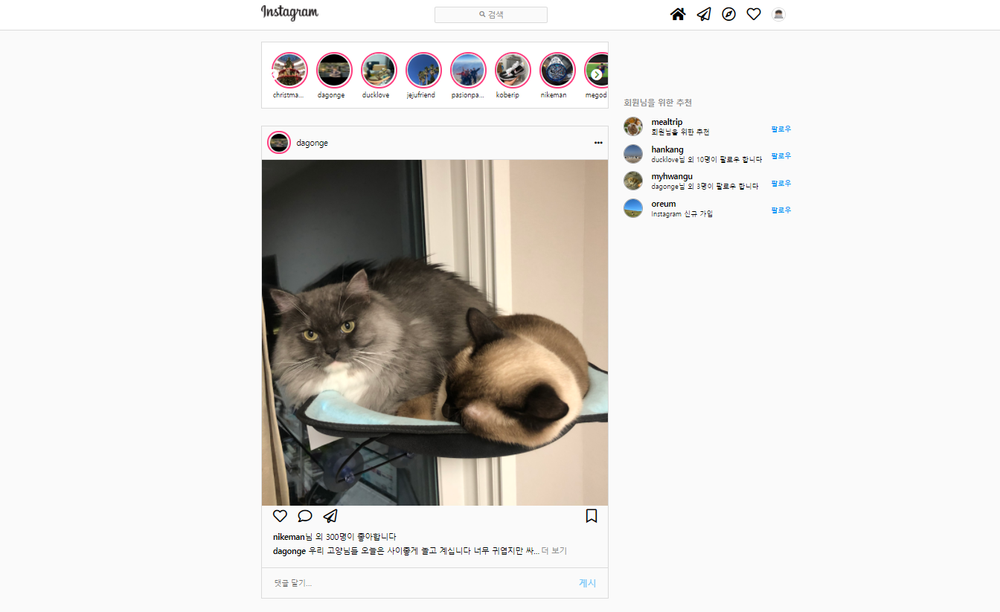

# instagram_clone

> 인스타그램 메인화면을 클론한 프로젝트입니다 이 프로젝트는 바닐라 JS 기능 구현이 적용 되었습니다

</br>

### 웹페이지 주소 [https://songchangyeop.github.io/instagram_clone/](https://songchangyeop.github.io/instagram_clone/)

</br>




# 1. Mock Data

> **JSON**을 이용하여 가상의 회원정보 MockData를 생성한 뒤에 fetch API를 이용하여 Data를 필요한 곳에 불러왔습니다

```
{
    "items":  [
        {
            "name" : "christmas25",
            "follow" : "true",
            "story" : "true",
            "image" : "imgs/christmas.jpg",
            "description" : "merry christmas !!"
        },
        {
            "name" : "mealtrip",
            "follow" : "false",
            "story" : "true",
            "image" : "imgs/meal.jpg",
            "status" : "회원님을 위한 추천",
            "description" : "맛집기행"
        },
        {
            "name" : "dagonge",
            "follow" : "true",
            "story" : "false",
            "image" : "imgs/dagonge.png",
            "description" : "사랑해 피꼬짱엽"
        },
        {
            "name" : "ducklove",
            "follow" : "true",
            "story" : "true",
            "image" : "imgs/duck.jpg",
            "description" : "duck dunk !!"
        }

        ...
```

</br>
</br>

# 2. Header

## 2-1 Search User

</br>

## filter Data

사용자 검색을 위해 input에 값이 입력되어지면 입력 값을 통해 데이터를 필터링하여 값에 맞는 데이터를 렌더링 해주는 검색기능을 구현해 보았습니다

> input에 값이 입력되어지면 그 값과 일치하는 값을 필터해주었습니다

```js
headerInput.addEventListener('keyup', () => renderSearchItem(inputIntems); //input에 값이 들어오면 json 데이터를 filter 하기위해 renderSearchItem 함수 호출
function renderSearchItem(items) {
    const searchText = headerInput.value;
    let filteredUsers = items.filter((item) => {
      if (item.name.toLowerCase().includes(searchText.toLowerCase())
         || item.description.toLowerCase().includes(searchText.toLowerCase())) {
        return item;
      }
    })
    displaySearchItem(filteredUsers) // 필터링된 값을 렌더하기 위한 함수 호출
}
```

filterUsers 라는 변수를 선언한 후에 input의 입력값과 Data의 이름이나 설명과 같으면 필터링 되도록 해주었습니다.

---

</br>
</br>

## Render Data

> input에 유저의 ID를 입력하면 검색결과를 나타내주었습니다

```js
const searchUser = document.querySelector('.header__userinfo');
function displaySearchItem(items) {
  while (searchUser.firstChild) {
    // 기존의 값 모두 삭제
    searchUser.removeChild(searchUser.firstChild);
  }
  items.forEach((item) => {
    let searchItem = document.createElement('li');
    searchItem.classList.add('header__userinfo-item');
    searchItem.innerHTML = `
    <div class="userinfo-prifile-img">
        
    </div>
    <div class="userinfo-profile-right">
        <span class="profile-name">${item.name}</span>
        <span class="profile-description">${item.description}</span>
    </div>
    `;
    searchUser.appendChild(searchItem);
  });
}
```

값이 입력되면 렌더하기 전에 기존의 값들을 모두 삭제한 이후 필터하여 다시 렌더하는 방식입니다 필터링 된 값을 forEach를 이용하여 화면에 나타냅니다

---

</br>
</br>

## 2-2 Modal

Header의 프로필 사진을 클릭하면 작은 메뉴 모달창이 나오도록 했습니다. 메뉴의 기능적인 역할은 하지 않으며 메뉴가 열린 상태에서 화면의 아무곳을 클릭하면 창이 닫히게 됩니다.

```js
// CSS
.header__menu-modal {
  width: 230px;
  height: auto;
  position: absolute;
  background-color: #fff;
  box-shadow: 0 0 5px 1px rgba(0, 0, 0, 0.0975);
  border-radius: 6px;
  z-index: 10;
}

// JS
document.addEventListener('click', (e) => {
    if(e.target.classList[0] !== 'myprofile-img') {
        headerMenu.classList.add('invisible');
        return;
    }

    if(headerMenu.classList[1] == 'invisible') {
        headerMenu.classList.remove('invisible');
    } else {
        headerMenu.classList.add('invisible');
    }
});
```

</br>
</br>

# 3. Story

**JSON**으로 이루어진 Mock Data 중에 Follow 상태인 유저만을 fetch API를 이용하여 Story 리스트에 추가하였습니다 별도의 클릭 이벤트는 없으며 좌우로 슬라이드가 가능하도록 슬라이드 버튼을 구현하였습니다 팔로우 중인 유저는 프로필사진 위에 핑크색 테두리가 생기게 하였습니다.

```js
function loaddata() {
  return fetch('data.json')
    .then((response) => response.json())
    .then((json) => json.items);
}

loaddata().then((items) => displayStoryItem(items));

const list = document.querySelector('.story__list');
const itemLength = 80;
let listWidth = 0;
function displayStoryItem(items) {
  items.forEach((item) => {
    if (item.follow == 'true') {
      listWidth += itemLength;
      let listItem = document.createElement('li');
      listItem.classList.add('story__item');
      listItem.innerHTML = `
                <div class="story__item-profile">
                  
                </div>
                <span>${item.name}</span>
    `;
      list.appendChild(listItem);
    }
  });
  list.style.width = `${listWidth}px`;
}
```

fetch API를 이용하여 불러온 Data를 forEach를 이용하여 follow 가 true인 유저만 Story List에 렌더해주는 함수입니다 이때 유저 Data의 수에 따라 각 user item의 width와 Story List의 총 width가 결정되어집니다.

---

</br>
</br>

```js
const nextBtn = document.querySelector('.story__next-btn');
const prevBtn = document.querySelector('.story__prev-btn');
let translist = 0; // 현재 이동한 translate 값
nextBtn.addEventListener('click', () => {
  translist += itemLength * 4;
  if (listWidth - translist < 600) {
    list.style.transform = `translate(-${listWidth - 600}px)`;
    translist = listWidth - 600;
    return;
  } else {
    list.style.transform = `translate(-${translist}px)`;
  }
});

prevBtn.addEventListener('click', () => {
  translist -= itemLength * 4;
  if (translist < 0) {
    list.style.transform = `translate(${0}px)`;
    translist = 0;
    return;
  } else {
    list.style.transform = `translate(${translist}px)`;
  }
});
```

Prev버튼과 Next버튼을 생성하여 각 버튼을 클릭시 Story List가 이동하게끔 구현하였습니다 이때 List가 끝에 닿으면 그 값에 맞게 translate 되게 하였습니다.

</br>
</br>

# 4. Post & Feed

게시글은 ❤를 클릭하면 좋아요 수가 증가하고 게시글의 사진을 더블클릭 했을 때도 좋아요가 수가 증가합니다 게시글의 정보가 길어지면 ... 으로 표시되게 하였으며 더보기를 누르면 정보가 모두 표시되게 됩니다 input에 글을 입력하면 댓글로 추가되게 하였으며 댓글은 **Local Storage**에 추가되도록 하였습니다.

</br>

## 4-1 Like

게시글의 ❤를 클릭하거나 사진을 더블클릭하면 좋아요 수가 증가하도록 하였습니다.

```js
// like
heartNormal.addEventListener('click', () => {
  likeAction(heartActive, heartNormal);
});

// Nolike
heartActive.addEventListener('click', () => {
  likeAction(heartNormal, heartActive);
});

// ❤ Toggle Action
function likeAction(removeClass, addClass) {
  addClass.classList.add('invisible');
  removeClass.classList.remove('invisible');

  let like = 300;
  if (heartNormal.classList[2] == 'invisible') {
    like = 301;
  }
  likeCount.innerHTML = `
    <span class="like-description">
    <b>nikeman</b>님 외 ${like}명이 좋아합니다</span>`;

  removeClass.style.transform = `scale(${1.2})`;
  setTimeout(() => {
    removeClass.style.transform = `scale(${1.0})`;
  }, 100);
}

// Like click Img
postImg.addEventListener('dblclick', () => {
  likeAction(heartActive, heartNormal);

  heartDblClick.style.transform = `scale(${1.2})`;
  setTimeout(() => {
    heartDblClick.style.transform = `scale(${1.0})`;
  }, 100);
  setTimeout(() => {
    heartDblClick.style.transform = `scale(${0})`;
  }, 800);
});
```

빨간색 ❤ 와 비어있는 ❤ 두개를 생성한 뒤 클릭하면 invisible 클래스를 추가하여 두개의 ❤가 바뀌게 하였습니다 더블클릭을 해서 좋아요를 할 경우에는 사진 중앙에 흰색의 하트가 나타났다가 사라지도록 구성하였습니다.

---

</br>
</br>

## 4-2 Comment

input에 값이 입력되면 Enter를 누르거나 게시 버튼을 클릭하면 댓글이 추가되도록 하였습니다 댓글은 **Local Storage**에 저장됩니다.

```js
// 댓글을 Local Storage에 저장하는 함수
function saveElement() {
    localStorage.setItem('commentItems', JSON.stringify(newItems));
}

function loadData() { Local Storage에 저장된 데이터를 불러오는 함수
    let output = localStorage.getItem('commentItems');
    let lodedItems = JSON.parse(output);
    if(lodedItems !== null) {
        lodedItems.forEach(loadItem => {
            createElement(loadItem.value);
        });
    }
}

const commentList = document.querySelector('.feed__comment-list');
// input의 Value를 댓글에 추가해주는 함수
function createElement(value) {
	const newId = commentItems.length + 1;
	const commentItem = document.createElement('li');
	const commentLeft = document.createElement('div');
	const commentLeftName = document.createElement('div');
	const commentUser = document.createElement('span');
	const commentValue = document.createElement('div');
	const commentValueText = document.createElement('span');
	const commentAction = document.createElement('div');
	const commentDelete = document.createElement('span');
	commentItem.classList.add('feed__comment-item');
	commentLeft.classList.add('feed__comment-left');
	commentLeftName.classList.add('comment-left__name');
	commentValue.classList.add('comment-left__description');
	commentDelete.classList.add('feed__comment-delete');
	commentUser.innerText = 'waitwait0301';
	commentValueText.innerText = `${value}`;
	commentDelete.innerText = '🗑';

	commentDelete.addEventListener('click', deleteToDo);

	commentItem.id = newId;

	commentAction.appendChild(commentDelete);
	commentLeftName.appendChild(commentUser);
	commentValue.appendChild(commentValueText);
	commentLeft.appendChild(commentLeftName);
	commentLeft.appendChild(commentValue);
	commentItem.appendChild(commentLeft);
	commentItem.appendChild(commentAction);
	commentList.appendChild(commentItem);

	const ItemObj = {
		value: value,
		id: newId,
	};
	commentItems.push(ItemObj);
	uproadBtn.classList.remove('Enter');
	saveElement(value);
}

```

createElement 함수는 input의 값을 댓글에 추가해주는 함수이며 그와 동시에 value를 Local Storage에 저장하기 위하여 saveElement 함수를 호출합니다
value에 저장된 값을 loadData 함수가 불러와서 브라우저를 종료한 뒤 다시 실행해도 댓글이 나타나있게 합니다.

---

</br>
</br>

## 4-3 Lead more

게시글의 더보기 버튼을 클릭하면 숨겨져 있던 게시글의 정보가 나타나게 됩니다

```js
// CSS
.post-description {
  width: 480px;
  margin-left: 20px;
  margin-bottom: 10px;
  overflow: hidden;
  text-overflow: ellipsis;
  white-space: nowrap;
}

.desccription-open {
  white-space: normal;
}

// JS
readMore.addEventListener('click', () => {
    postDescription.classList.add('desccription-open');
    postDescription.style.width = `${510}px`;
    readMore.style.display = 'none';
});
```

overflow: hidden 옵션으로 긴 정보를 가려주고 text-overflow: ellipsis 옵션으로 잘린 텍스트를 ... 으로 나타냅니다 white-space: nowrap 옵션으로
줄 바꿈을 억제하여 텍스트를 가려줍니다 readMore가 클릭되면 desccription-open 클래스가 추가되면서 줄바꿈이 이루어지고 더보기 버튼이 display : none 이 되면서 정보가 모두 나타나게 됩니다.

</br>
</br>

# 5. Recommand

사이드바 영역의 recommand 섹션입니다 회원정보의 follow가 false인 회원만 나타나게 되며 각 회원의 팔로우 정보가 나타나게 됩니다 이 회원들의 팔로우 버튼을 클릭하면 팔로잉이 되었다고 변경됩니다.

```js
const recommandList = document.querySelector('.recommand__list');
function displayRecommandItem(item) {
  let i = 0; //  각 회원의 id를 위한 변수 선언
  item.forEach((item) => {
    if (item.follow == 'true') {
      return;
    } else {
      i++; //follow가 false일 경우 i가 증가되게 하여 각 회원마다 id를 부여
    }
    let recommandItem = document.createElement('li');
    recommandItem.classList.add('recommand__item');
    recommandItem.innerHTML = `
        <div class="recommand__left">
                <div class="recommand__item-img">
                  
                </div>
                <div class="recommand__profile">
                  <div class="recommand__profile-name"><span>${item.name}</span></div>
                  <div class="recommand__profile-description">
                    <span>${item.status}</span>
                  </div>
                </div>
              </div>
              <div class="recommand__right" data-id ="${i}"><span class="follow">팔로우</span></div>
        `;
    recommandList.appendChild(recommandItem);
  });
}
```

회원정보의 follow가 true이면 return이 되게하여 현재 팔로우 중이지 않은 회원만 표시되게 하였습니다. 또 각 회원의 data-set에 id를 부여하여 팔로우 버튼을 누를 경우 어떤 회원을 팔로우 하는지 구별하게 하였습니다.

---

</br>
</br>

```js
recommandList.addEventListener('click', (e) => {
  const follow = document.querySelectorAll('.recommand__right');
  const target = e.target;
  if (target.parentNode.classList[0] == 'recommand__right') {
    //클릭한 팔로우 버튼에 맞는 회원을 찾기위한 switch
    switch (target.parentNode.dataset.id) {
      case '1':
        toggleFollow(0, follow);
        break;
      case '2':
        toggleFollow(1, follow);
        break;
      case '3':
        toggleFollow(2, follow);
        break;
      case '4':
        toggleFollow(3, follow);
        break;
    }
  }
});

function toggleFollow(data, follow) {
  if (follow[data].childNodes[0].classList[0] == 'follow') {
    follow[data].innerHTML = `<span class="following">팔로잉</span>`;
  } else {
    follow[data].innerHTML = `<span class="follow">팔로우</span>`;
  }
}

loaddata().then((item) => displayRecommandItem(item));
```

팔로우 버튼을 클릭했을 때 그 팔로우 버튼에 맞는 회원의 data-set을 찾아 일치하면 팔로잉으로 변경해줍니다.
